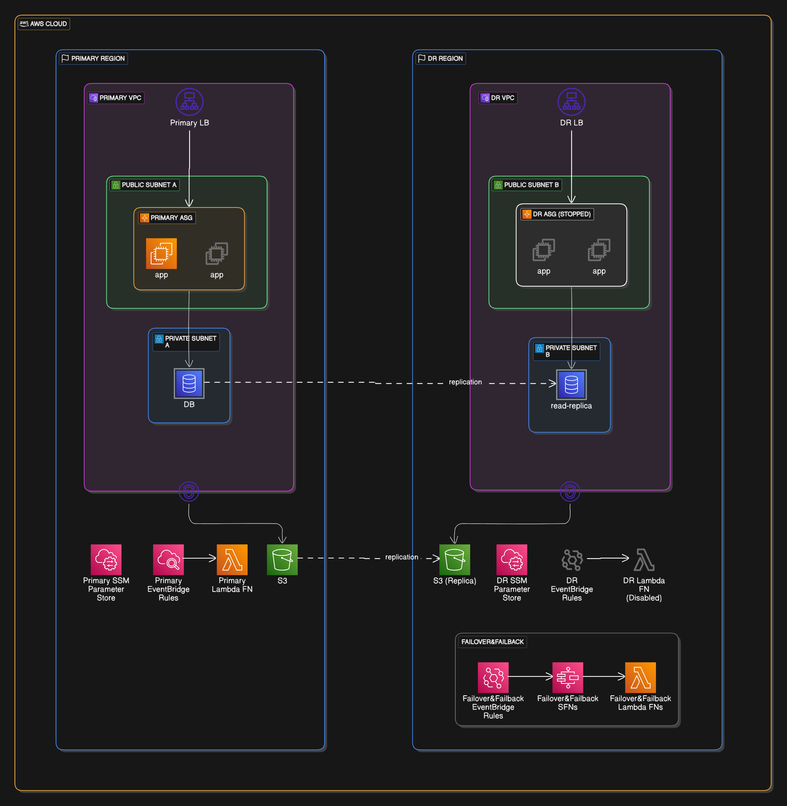

# Pilot Light Disaster Recovery Solution

## Overview

This document describes the implementation of a Pilot Light disaster recovery (DR) strategy using AWS services. The solution maintains a minimal version of the environment in a secondary region that can be rapidly scaled up during a disaster, focusing on essential services (EC2, RDS, S3, and Lambda). The solution is designed to be cost-effective and scalable, with minimal resources running in the Disaster Recovery (DR) region.

## Architecture Components



### Primary Region (Production)

- VPC
  - Public and private subnets
  - Security groups
  - Internet Gateway and VPC endpoints for S3
- EC2 instances in Auto Scaling Group (ASG)
- RDS MySQL database (primary)
- S3 bucket with cross-region replication enabled
- Lambda functions with configured event sources
- Application Load Balancer
- EventBridge scheduled AMI creation

### DR Region (Pilot Light)

- VPC with public and private subnets
- Auto Scaling Group (scaled to 0 instances)
- RDS Read Replica
- S3 bucket (replication target)
- Lambda functions (disabled state)
- Application Load Balancer (pre-configured)

### Automation Components

- Lambda functions for failover/failback operations
- EventBridge rules for automated failover
- SSM Parameter Store for configuration
- IAM roles and policies

## Normal Operation

### Data Synchronization

1. **Database**: Cross-region read replica maintains synchronization with primary RDS
2. **S3**: Cross-Region Replication (CRR) with versioning enabled
3. **AMI**: Automated creation and copying to DR region
4. **Configuration**: SSM Parameter Store synchronization

### Cost Optimization

- DR region runs minimal resources:
  - ASG scaled to 0 instances
  - RDS read replica (necessary cost)
  - Pre-provisioned but inactive load balancer
  - S3 bucket for replication
  - Disabled Lambda functions

## Disaster Recovery Process

### Automated Failover

Triggered by CloudWatch monitoring or manual intervention:

1. **Database Promotion**
   - DR Lambda promotes RDS read replica to primary
   - Original primary becomes unavailable

2. **Compute Resources**
   - Latest AMI is selected in DR region
   - ASG launch template is updated
   - ASG scaled up to handle production load

3. **Lambda Functions**
   - Enable Lambda functions in DR region
   - Configure event sources

### Manual Failover

Can be triggered through AWS Console or CLI:

```bash
aws lambda invoke \
  --function-name dev-dr-failover \
  --region us-east-1 \
  output.json
```

### Recovery Time

- **RTO (Recovery Time Objective)**: ~10-15 minutes
  - RDS promotion: ~5-10 minutes
  - ASG scaling: ~5 minutes
- **RPO (Recovery Point Objective)**:
  - Database: seconds to minutes (async replication)
  - S3: minutes (async replication)

## Failback Process

### Automated Failback

Triggered when primary region is restored:

1. **Database Restoration**
   - Create snapshot of DR database
   - Copy snapshot to primary region
   - Restore primary database
   - Create new read replica in DR region

2. **Compute Resources**
   - Update primary region ASG with latest AMI
   - Scale up primary ASG
   - Scale down DR ASG

### Manual Failback

Can be triggered through AWS Console or CLI:

```bash
aws lambda invoke \
  --function-name dev-dr-failback \
  --region us-east-1 \
  output.json
```

## Testing and Maintenance

### Regular Testing Schedule

1. Monthly failover test to DR region
2. Quarterly full DR simulation
3. Bi-annual failback testing

### Monitoring

- CloudWatch alarms for key metrics:
  - EC2 instance health
  - RDS replica lag
  - Lambda function execution errors
- Health checks for DR readiness
- EventBridge rules for automated testing

### Maintenance Tasks

1. Regular validation of AMI copying
2. Monitoring of S3 replication metrics
3. Testing of Lambda functions
4. Review and update of IAM policies
5. Regular updates to DR documentation

## Cost Considerations

### Primary Region

- Full production environment costs

### DR Region

- RDS Read Replica: Full instance cost
- S3: Replication and storage costs
- ASG: Minimal costs (0 instances)
- Load Balancer: Hourly cost
- Lambda: Minimal costs (disabled functions)

## Security

### Data Protection

- Encryption at rest for RDS and S3
- VPC security groups for access control
- IAM roles with minimal required permissions

### Network Security

- Private subnets for application and database
- Security groups for fine-grained access control
- VPC endpoints for AWS services

## Limitations and Considerations

1. **Asynchronous Replication**
   - Potential for data loss during failover
   - RPO dependent on network latency

2. **DNS Propagation**
   - May affect actual RTO
   - Consider Route 53 health checks

3. **Cost vs. Recovery Time**
   - Faster recovery requires more running resources
   - Balance based on business requirements

## Troubleshooting

### Common Issues

1. **Failed Failover**
   - Check Lambda execution logs
   - Verify IAM permissions
   - Validate RDS replica status

2. **Replication Delays**
   - Monitor RDS replication lag
   - Check S3 replication metrics
   - Verify network connectivity
